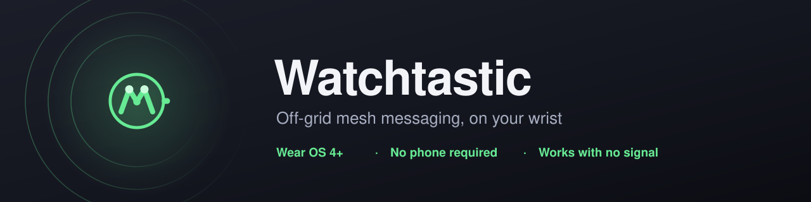
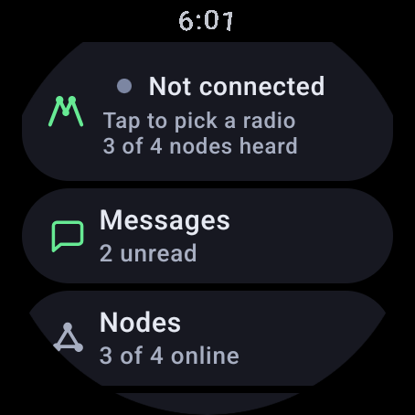
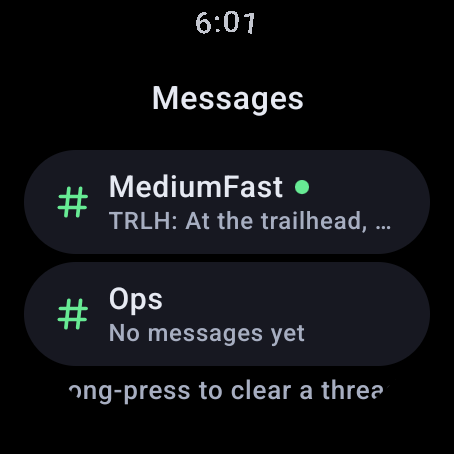
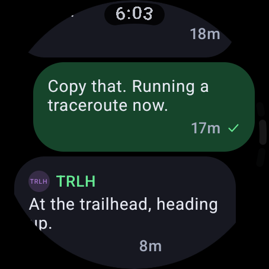
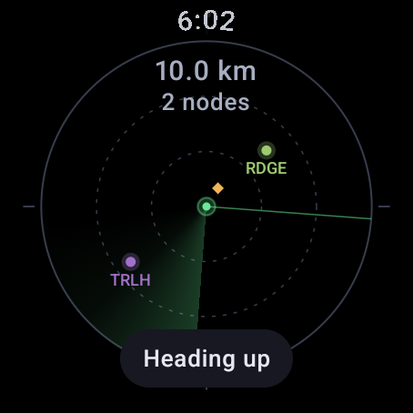
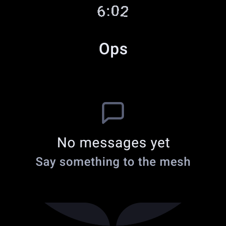

<div align="center">



**A [Meshtastic](https://meshtastic.org) client that lives on your wrist.**

Off-grid mesh messaging on your watch. Talks to your radio directly over Bluetooth —
no phone in the loop, no companion app, no cell signal.

[](https://github.com/GPTmadeit/Watchtastic/releases/latest)
[](https://github.com/GPTmadeit/Watchtastic/actions/workflows/ci.yml)
[](https://wearos.google.com/)
[](LICENSE)

</div>

---

## What problem does this solve?

[Meshtastic](https://meshtastic.org) radios build a long-range mesh network over LoRa —
text messaging and location sharing with **no cell service, no wifi, and no
infrastructure**. Hikers, event crews, search-and-rescue teams and off-roaders use it to
stay in contact where phones simply don't work.

The catch is that you normally drive one from a phone. So you're out in the field taking
your phone out of a pocket, waking it, unlocking it, and finding the app — every time you
want to read one short message.

**Watchtastic puts the whole client on your watch.** The radio stays in your pack. You
read messages, see who's on the mesh, and navigate toward them from your wrist.

<div align="center">









<sub>Home · Messages · Chat — Map · Nodes · Node detail</sub>

</div>

---

## Features

| | |
|---|---|
| 💬 **Messaging** | Channels and direct messages. Dictate, type, tap a saved phrase, or send an emoji reaction. Every message shows whether it actually arrived. |
| 🔔 **Real notifications** | Messages pop up like a text, and you can **reply straight from the notification** without opening the app. New nodes get a quieter alert on their own channel. |
| 🗺️ **Offline mesh map** | Everyone around you plotted by true bearing and great-circle distance. Twist the crown to zoom from 250 m to 100 km. Works with no network at all. |
| 🧭 **Compass navigation** | Point the watch at any node and walk. A needle, a distance, and a tick on your wrist when you're facing the right way. |
| 📍 **Waypoints** | Mark a spot using the watch's own GPS and share it with the whole mesh. |
| 📡 **Radio control** | Battery, signal, air time, hop counts, firmware — plus region, modem preset, hop limit and device role, without digging out your phone. |
| 🛰️ **GPS donor** | Hand the watch's GNSS fix to a radio that has no GPS module of its own. |
| 🔄 **Self-updating** | Checks GitHub Releases and installs updates, with signature pinning so only genuinely-signed builds can install. |

Built for the **Pixel Watch 4** — the domed display, rotating crown and haptic motor all
get used deliberately — but it runs on any **Wear OS 4+** watch with Bluetooth.

---

## Requirements

| | |
|---|---|
| **Watch** | Wear OS 4 or newer (Android 13+, API 33+), with Bluetooth LE |
| **Radio** | Any Meshtastic device with Bluetooth enabled — Heltec, RAK, T-Beam, LilyGo, Station G, Seeed and others |
| **Phone** | Only for installing. Not needed to use the app. |
| **Network** | None. Only the optional self-updater uses the internet. |

---

## Quick start

### 1. Install it

<details open>
<summary><b>The easy way — WatchPush (no computer needed)</b></summary>

Installing anything on a watch is normally a laptop-and-terminal job. It isn't anymore.

**[WatchPush](https://github.com/GPTmadeit/WatchPush)** is a companion app that sideloads
APKs onto your watch straight from your phone.

1. **[Download WatchPush](https://github.com/GPTmadeit/WatchPush/releases/latest)** and
   install it on your Android phone.
2. **[Download the Watchtastic APK](https://github.com/GPTmadeit/Watchtastic/releases/latest)**
   — the file named `Watchtastic-<version>-release.apk`.
3. On the watch: **Settings → Developer options → Wireless debugging → On**.
4. In WatchPush: **Scan network** → pair with the watch → pick the APK → **Install on
   watch**.

> **No Developer options?** On the watch, go to **Settings → System → About** and tap
> **Build number** seven times.

</details>

<details>
<summary><b>The manual way — ADB</b></summary>

```bash
# Enable Wireless debugging on the watch first, then:
adb pair <watch-ip>:<pairing-port>      # only needed once
adb connect <watch-ip>:<port>
adb install -r Watchtastic-1.4.2-release.apk
```

</details>

### 2. Connect your radio

1. Open Watchtastic and tap **Grant access** — it needs Bluetooth to reach the radio.
2. It scans automatically. Only Meshtastic radios appear, so the list stays short.
3. Tap yours. If it asks to pair, **the PIN is displayed on the radio's own screen**.
4. Wait for the sync — it's downloading the node database and your channels.

That's it. You're on the mesh.

### 3. Send your first message

**Messages** → pick a channel → tap the green **Reply** button at the bottom → dictate or
type → send. A tick appears next to your message once the mesh confirms it arrived.

---

## Usage

### Replying quickly

Three ways, in order of speed — because if replying is slow, people reach for their phone
instead:

| Speed | How |
|---|---|
| One tap | **Emoji reaction** — long-press any message, pick a tapback |
| Two taps | **Quick reply** — a saved phrase, editable in Settings |
| Longer | **Dictate or type** — the edge button opens the system input |

You can also reply **directly from the notification** without opening the app at all.

### Finding someone

- **Map** shows everyone plotted around you. Turn the crown to change the range. Tap a
  blip to open that node.
- **Node detail → Position → tap** opens the compass. Turn until the arrow points up and
  walk; you'll feel a tick when you're on the bearing.

### Sharing where you are

- **Settings → Share watch GPS** gives your radio the watch's own position, which is
  useful if the radio has no GPS module.
- In a channel, **Position** broadcasts your location once.
- **Waypoints → Drop here** marks a spot for the whole mesh. It takes a GPS fix on demand,
  so you don't need continuous sharing switched on.

### Managing the mesh

- **Long-press a channel** to mute it on the watch only.
- **Long-press a conversation** to clear it.
- **Node detail** has favourite, mute, ignore, remove, request position and traceroute.

---

## Configuration

Everything is under **Settings**.

| Setting | Default | What it does |
|---|---|---|
| **Auto-connect** | On | Reconnect to your saved radio on launch |
| **Share watch GPS** | Off | Feed the watch's GNSS fix to the radio as its position |
| **Allow MQTT relay** | On | Sets the consent flag asking gateways to forward your traffic to MQTT. Turn off to keep your messages on the mesh. |
| **Channel messages** | On | Notify for channel traffic, not just direct messages |
| **Haptics** | On | Buzz on mesh events |
| **Imperial units** | Off | Miles and feet instead of km and metres |
| **Quick replies** | 8 defaults | Edit the phrases you can send in two taps |

**Radio configuration** (region, modem preset, hop limit, transmit, device role) is a
separate screen, since each change reboots the radio.

---

## Troubleshooting

| Problem | Try this |
|---|---|
| **App won't install** | The watch needs "install unknown apps" allowed for the installer you're using. WatchPush walks you through it. |
| **`INSTALL_PARSE_FAILED_NO_CERTIFICATES`** | The APK is unsigned. Download the official release asset rather than building it yourself without a keystore. |
| **No radios found** | Bluetooth on? Radio powered and in range? Bluetooth enabled in the *radio's* own settings? |
| **Stuck on "Pairing"** | The PIN appears on the radio's screen. If it never shows, forget the device in the watch's Bluetooth settings and retry. |
| **Can't switch to a different radio** | Fixed in 1.4.0 — update if you're older than that. |
| **Channel shows the wrong name** | Fixed in 1.4.0. The primary channel takes its name from your modem preset. |
| **Messages don't reach my MQTT logger** | Fixed in 1.4.0. Check **Settings → Allow MQTT relay** is on. |
| **Messages don't pop up** | Watch **Settings → Apps → Watchtastic → Notifications** and make sure the *Messages* channel isn't silenced. |
| **Keeps reconnecting** | Normal at the edge of range — it backs off and retries. Check the radio's battery. |
| **Map says "No position"** | Neither the watch nor the radio has a fix yet. Enable **Share watch GPS**, or wait for the radio's GPS. |

Still stuck? [Open an issue](https://github.com/GPTmadeit/Watchtastic/issues/new?template=bug_report.yml)
with your watch model, radio model and firmware version.

---

## FAQ

<details>
<summary><b>Do I need my phone nearby?</b></summary>

No. Watchtastic is a standalone Wear OS app — it talks to the radio itself over
Bluetooth. Your phone is only involved when installing.
</details>

<details>
<summary><b>Will it work with my radio?</b></summary>

If it runs Meshtastic firmware with Bluetooth enabled, yes. The app uses the standard
Meshtastic Bluetooth API, not anything vendor-specific.
</details>

<details>
<summary><b>Why doesn't the map show streets?</b></summary>

A tiled map needs a data connection, and the reason you own a Meshtastic radio is being
somewhere without one. It would be dead weight exactly when it matters most.

Instead the map draws what the mesh already told you — who's out there, which direction,
how far — and works identically in a valley with no signal. When street context genuinely
helps, node detail hands the coordinates to your watch's maps app.
</details>

<details>
<summary><b>Why are messages limited to 200 characters?</b></summary>

That's a LoRa constraint. A Meshtastic data payload is capped at 233 bytes, and clients
reserve the rest for the envelope.
</details>

<details>
<summary><b>Can I create or re-key channels?</b></summary>

No — that needs QR codes and pre-shared keys, which a 1.2" screen isn't the right place
for. Set channels up in the official Meshtastic app; Watchtastic uses whatever your radio
already has.
</details>

<details>
<summary><b>What does it do to my battery?</b></summary>

It holds a Bluetooth connection in the background so messages arrive with the screen off,
which costs some battery. **Settings → Disconnect** drops the link without forgetting the
radio.
</details>

<details>
<summary><b>Does it collect any data?</b></summary>

No. No analytics, no telemetry, no crash reporting, no accounts, no third-party SDKs. The
only internet request it ever makes is an anonymous check of this repository's releases
for updates. See [SECURITY.md](SECURITY.md).
</details>

<details>
<summary><b>Is updating in-app safe?</b></summary>

It's constrained deliberately: a downloaded APK installs only if its signing certificate
is byte-identical to the running app's, the package name must match, downgrades are
refused, and Android's own installer asks you to confirm. Details in
[SECURITY.md](SECURITY.md).
</details>

<details>
<summary><b>Which watches work?</b></summary>

Any Wear OS 4+ (API 33+) watch with Bluetooth LE. It's developed and tested against the
Pixel Watch line and a Wear OS emulator; other manufacturers should work but haven't been
individually verified.
</details>

---

## Development

```bash
git clone https://github.com/GPTmadeit/Watchtastic.git
cd Watchtastic
./gradlew testDebugUnitTest     # 26 unit tests, no device needed
./gradlew assembleDebug
```

**Requirements:** JDK 17 and Android SDK 36.

The debug APK is signed with Android's standard debug key and installs immediately. The
release variant needs signing material — see [docs/RELEASING.md](docs/RELEASING.md).

| Document | What's in it |
|---|---|
| [CONTRIBUTING.md](CONTRIBUTING.md) | Setup, workflow, and three rules that prevent real damage |
| [docs/ARCHITECTURE.md](docs/ARCHITECTURE.md) | How it's built, and why the awkward parts are that way |
| [docs/RELEASING.md](docs/RELEASING.md) | Versioning, signing, cutting a release |
| [docs/ROADMAP.md](docs/ROADMAP.md) | Known limitations and what's likely next |
| [CHANGELOG.md](CHANGELOG.md) | What changed in every version |

Built with Kotlin, Jetpack Compose for Wear OS, and protobuf-javalite. No DI framework,
no Room, no Play Services — so it installs on any Wear OS device.

---

## Contributing

Contributions are welcome. Start with [CONTRIBUTING.md](CONTRIBUTING.md), which covers
building, testing, and the constraints that matter — particularly that Meshtastic config
writes **replace rather than merge**, so a careless edit can reset settings on someone's
radio.

Bug reports are genuinely useful. Watch model, radio model, firmware version and modem
preset are the details that make them reproducible.

Please also read the [Code of Conduct](CODE_OF_CONDUCT.md).

---

## Security

Report vulnerabilities privately through
[GitHub Security Advisories](https://github.com/GPTmadeit/Watchtastic/security/advisories/new),
not a public issue. [SECURITY.md](SECURITY.md) documents what the app trusts, what leaves
your device, and how the self-updater is constrained.

---

## Licence

[GPL-3.0](LICENSE). The vendored Meshtastic `.proto` definitions are © the Meshtastic
project under the same licence, which is why this app is GPL too.

"Meshtastic" and the Meshtastic logo are trademarks of the Meshtastic project. This is an
independent client, not affiliated with or endorsed by it. The Watchtastic mark is an
original design in the same visual family, not a reproduction.
